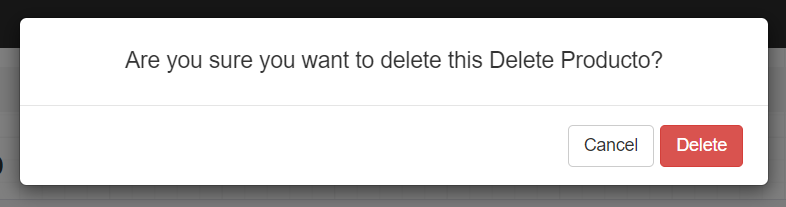
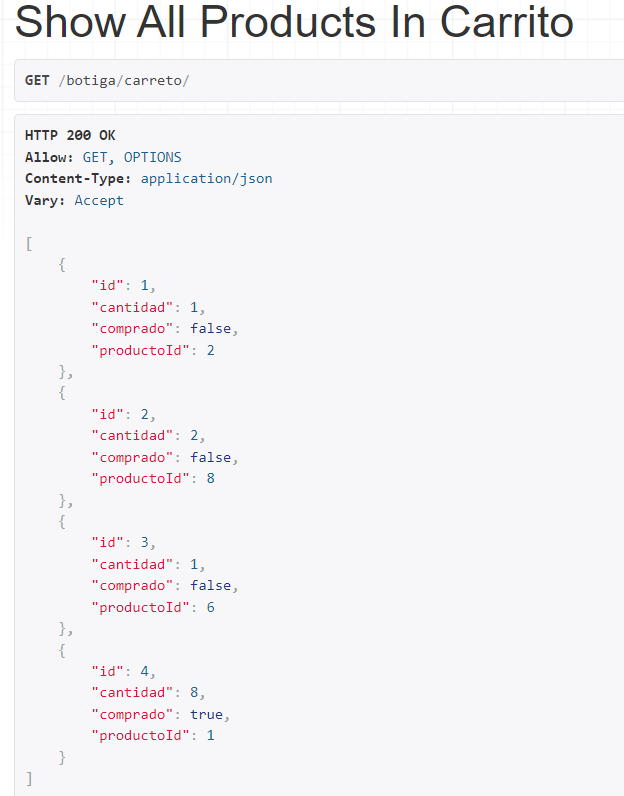

# -M07_UF4_practica20recuperacion

# Catalogo

Estas son las funciones que se ha utilizado para añadir, ver, eliminar y editar los productos

Funcion para ver todos los productos

Funcion para ver los productos buscados por un ID

Funcion para añadir productos

Funcion para actualizar productos

Funcion para eliminar productos

A continuacion muestro las url necesarias para caralogo

Por ultimo mostrare el modelo y el serializer: 

Estre es el modelo

Y este el serializer que cojera los datos de la tabla para verlos en json

# Carreto

Estas son las funciones que he utilizado en el archivo de views de carreto

Funcion para añadir productos a la tabla de carreto

Funcion para ver los productos del carrito

Funcion para eliminar 1 o todos los productos del carrito

Funcion para cambiar el estado del pedido y la cantidad del producto

Funcion que comprueba el estado del pedido para verificar si se vendio o no

(True = Vendido, False = No vendido)

