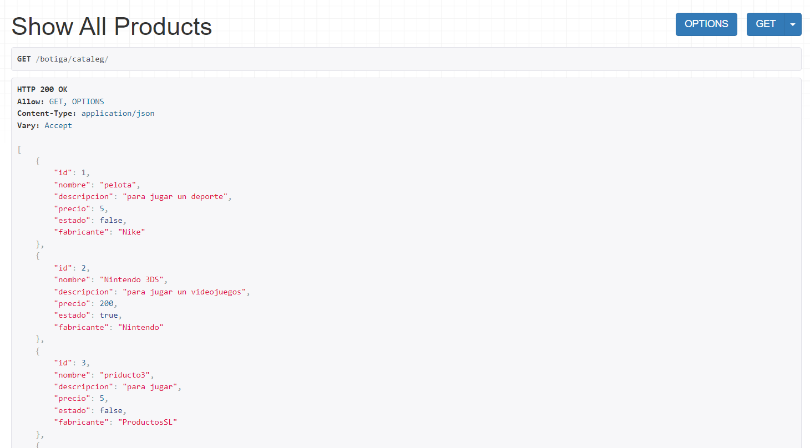
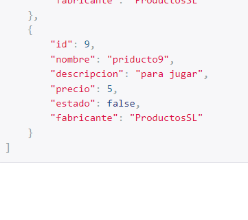
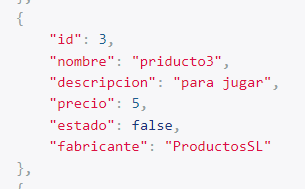
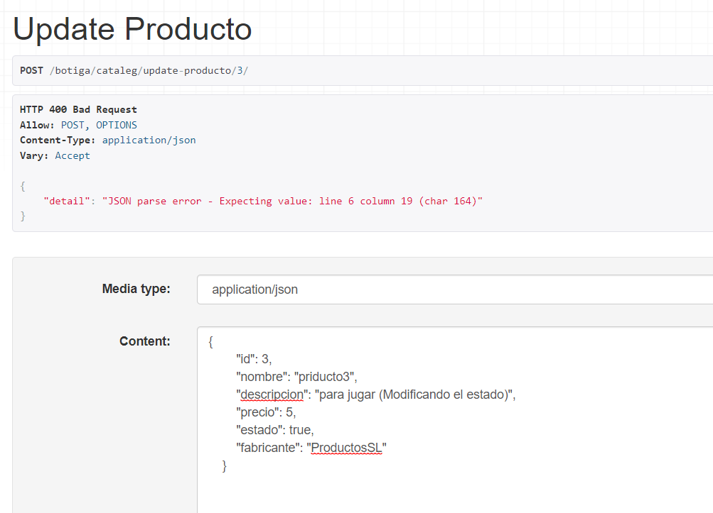
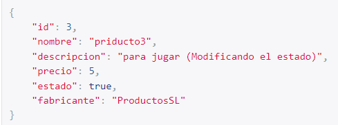

# -M07_UF4_practica20recuperacion

# Este es el funcionamiento de la tienda

añade productos

Muestra los productos creados, todos y por ID

Elimina 1 preoducto

Actualiza 1 producto

# Carreto

añadir productos a la tabla carreto enlazandolos con el id del producto

mostar carrito

Eliminar un producto del carrito

Actualizar un produto del carrito para modificar el estardo de compra y la cantidad del mismo

Eliminar todo el carrito

Comprobar el estado de la compra de un producto

Como se puede apreciar solo el que tiene el esatdo de compra de true esta vendido

# Comandes

